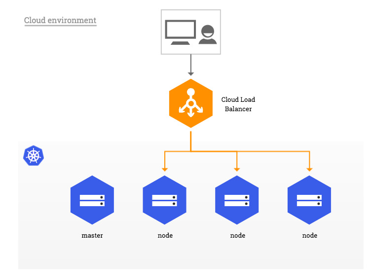
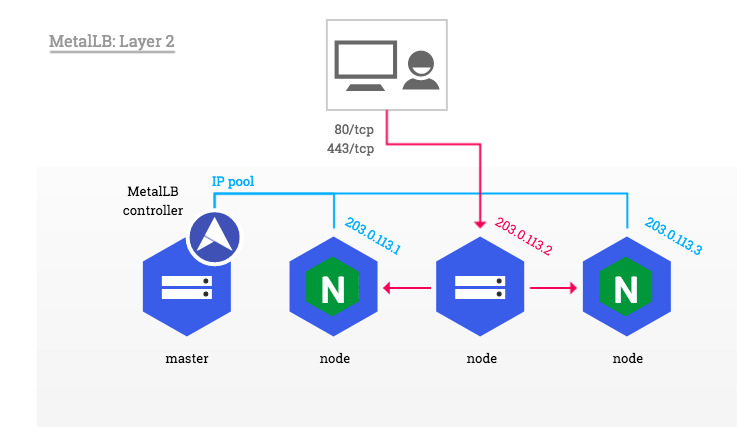
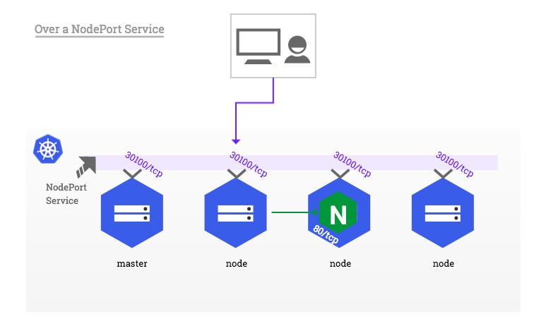

# 裸机注意事项

在传统的云环境中，可以按需使用网络负载平衡器,
单个Kubernetes manifest足以为外部客户端以及与集群内部运行的任何应用程序提供nginx Ingress控制器的单点联系。
裸机环境缺少这种场景，需要稍微不同的设置才能为外部消费者提供相同的访问权限。




本文档的其余部分介绍了一些建议的方法，这些方法用于在裸机上运行的Kubernetes集群内部署nginx Ingress控制器。

## 纯软件解决方案:MetalLB

[MetalLB][metallb] 为不在受支持的云提供商上运行的Kubernetes群集提供了网络负载平衡器实现，从而有效地允许在任何群集中使用LoadBalancer Services

本节演示在具有公共可访问节点的Kubernetes集群中，如何使用 MetalLB [二层配置模式][metallb-l2] 与nginx Ingress控制器一起使用， 在这种模式下，一个节点吸引了所有入口nginx服务IP的流量。有关更多详细信息，请参见[流量策略][metallb-trafficpolicies]获取更多信息.



!!! 备注
    其他支持的配置模式的描述不在本文档的讨论范围之内。

!!! 警告
    MetalLB目前处于 *beta* 节点. 阅读有关 [项目成熟度][metallb-maturity] 并确保您通读完整的官方文档以告知自己。

MetalLB可以使用简单的Kubernetes清单或Helm进行部署。本示例的其余部分假定已按照 [Installation][安装] 说明部署了MetalLB.

MetalLB需要IP地址池，以便能够拥有`ingress-nginx`服务的所有权，
可以在名为config的ConfigMap中定义此池，该ConfigMap与MetalLB控制器位于同一名称空间中
在最简单的情况下，该池由Kubernetes节点的IP地址组成，但是IP地址也可以由DHCP服务器分发。

!!! 例子
    给定以下3节点Kubernetes集群(以添加外部IP为例，在大多数裸机环境中，此值为<None>)

    ```console
    $ kubectl get node
    NAME     STATUS   ROLES    EXTERNAL-IP
    host-1   Ready    master   203.0.113.1
    host-2   Ready    node     203.0.113.2
    host-3   Ready    node     203.0.113.3
    ```

    创建以下ConfigMap后，MetalLB将拥有池中IP地址之一的所有权，并相应地更新`ingress-nginx`服务的*loadBalancer*的IP字段

    ```yaml
    apiVersion: v1
    kind: ConfigMap
    metadata:
      namespace: metallb-system
      name: config
    data:
      config: |
        address-pools:
        - name: default
          protocol: layer2
          addresses:
          - 203.0.113.2-203.0.113.3
    ```

    ```console
    $ kubectl -n ingress-nginx get svc
    NAME                   TYPE          CLUSTER-IP     EXTERNAL-IP  PORT(S)
    default-http-backend   ClusterIP     10.0.64.249    <none>       80/TCP
    ingress-nginx LoadBalancer  10.0.220.217   203.0.113.3  80:30100/TCP,443:30101/TCP
    ```

一旦MetalLB设置了`ingress-nginx` LoadBalancer服务的外部IP地址，
将在iptables NAT表中创建相应的条目，并且具有选定IP地址的节点将开始在LoadBalancer服务中配置的端口上响应HTTP请求:

```console
$ curl -D- http://203.0.113.3 -H 'Host: myapp.example.com'
HTTP/1.1 200 OK
Server: nginx/1.15.2
```

!!! 提示
    为了保留发送到NGINX的HTTP请求中的源IP地址，必须使用本地流量策略。流量策略以及下一节将更详细地介绍[流量策略][metallb-trafficpolicies]

[metallb]: https://metallb.universe.tf/
[metallb-maturity]: https://metallb.universe.tf/concepts/maturity/
[metallb-l2]: https://metallb.universe.tf/tutorial/layer2/
[metallb-install]: https://metallb.universe.tf/installation/
[metallb-trafficpolicies]: https://metallb.universe.tf/usage/#traffic-policies

## 通过NodePort服务

由于其简单性，这是用户按照[安装指南][install-baremetal].中描述的步骤默认部署的设置

!!! 信息
   ` NodePort`类型的服务通过`kube-proxy`组件在每个包含master的Kubernetes节点上公开相同的非特权端口(默认值:30000-32767)。有关更多信息，请参见 [Services][nodeport-def].

在此配置中，NGINX容器与主机网络保持隔离。结果，它可以安全地绑定到任何端口，包括标准的HTTP端口80和443。
但是，由于容器名称空间的隔离，位于群集网络外部的客户端(例如在公网的客户端)，无法直接在端口80和443上访问Ingress主机。
相反，外部客户端必须将分配给`ingress-nginx`服务的NodePort附加到HTTP请求



!!! 例子
    给定分配给`ingress-nginx`服务的NodePort 30100

    ```console
    $ kubectl -n ingress-nginx get svc
    NAME                   TYPE        CLUSTER-IP     PORT(S)
    default-http-backend   ClusterIP   10.0.64.249    80/TCP
    ingress-nginx NodePort    10.0.220.217   80:30100/TCP,443:30101/TCP
    ```

    和一个具有公共IP地址203.0.113.2的Kubernetes节点(以添加外部IP为例，在大多数裸机环境中，此值为<None>)

    ```console
    $ kubectl get node
    NAME     STATUS   ROLES    EXTERNAL-IP
    host-1   Ready    master   203.0.113.1
    host-2   Ready    node     203.0.113.2
    host-3   Ready    node     203.0.113.3
    ```

    客户端将通过以下地址访问主机名为:myapp.example.com的Ingress，地址为http://myapp.example.com:30100，其中myapp.example.com子域解析为203.0.113.2 IP地址

!!! 危险 "对主机系统的影响"
    虽然使用--service-node-port-range API服务器标志重新配置NodePort范围听起来很诱人，以包括非特权端口并能够公开端口80和443，这样做可能会导致意外的问题，包括(但不限于)使用原本保留给系统守护程序的端口，以及授予它可能不需要的kube-proxy特权的必要性。
    
    因此不鼓励这种做法。有关替代方法，请参见本页中提出的其他方法。

这种方法还有一些其他局限性，您应该意识到:

* **源IP地址**

默认情况下，NodePort类型的服务执行 [源地址转换][nodeport-nat]. 这意味着HTTP请求的源IP始终是从NGINX角度接收到该请求的Kubernetes节点的IP地址

建议在NodePort设置中保留源IP的方法是将`ingress-nginx`服务规范的`externalTrafficPolicy`字段的值设置为`Local` ([example][preserve-ip]).

!!! 警告
    此设置可有效丢弃发送到未运行nginx Ingress控制器任何实例的Kubernetes节点的数据包。
    可以考虑将[nginx Pod分配给特定节点][pod-assign] 以控制调度或不调度nginx Ingress控制器的节点

!!! 例子
    在由3个节点组成的Kubernetes集群中(以添加外部IP为例，在大多数裸机环境中，此值为<None>)

    ```console
    $ kubectl get node
    NAME     STATUS   ROLES    EXTERNAL-IP
    host-1   Ready    master   203.0.113.1
    host-2   Ready    node     203.0.113.2
    host-3   Ready    node     203.0.113.3
    ```

    由2个副本组成的nginx-ingress-controller Deployment

    ```console
    $ kubectl -n ingress-nginx get pod -o wide
    NAME                                       READY   STATUS    IP           NODE
    default-http-backend-7c5bc89cc9-p86md      1/1     Running   172.17.1.1   host-2
    nginx-ingress-controller-cf9ff8c96-8vvf8   1/1     Running   172.17.0.3   host-3
    nginx-ingress-controller-cf9ff8c96-pxsds   1/1     Running   172.17.1.4   host-2
    ```

    发送到`host-2`和`host-3`的请求将转发到NGINX，原始客户端的IP将保留，
    而发送给`host-1`的请求将被丢弃，因为该节点上没有运行NGINX副本

* **ngress状态**

由于NodePort Services未获得按定义分配的LoadBalancerIP，因此nginx Ingress控制器**不会更新其管理的Ingress对象的状态**

```console
$ kubectl get ingress
NAME           HOSTS               ADDRESS   PORTS
test-ingress   myapp.example.com             80
```

尽管事实是没有负载平衡器为nginx Ingress控制器提供公共IP地址,
通过设置`ingress-nginx`服务的`externalIPs`字段，可以强制所有托管Ingress对象的状态更新

!!! 警告
    There is more to setting `externalIPs` than just enabling the nginx Ingress controller to update the status of
    Ingress objects. Please read about this option in the [Services][external-ips] page of official Kubernetes
    documentation as well as the section about [External IPs](#external-ips) in this document for more information.

!!! 例子
    给定以下3节点Kubernetes集群(以添加外部IP为例，在大多数裸机环境中，此值为<None>)

    ```console
    $ kubectl get node
    NAME     STATUS   ROLES    EXTERNAL-IP
    host-1   Ready    master   203.0.113.1
    host-2   Ready    node     203.0.113.2
    host-3   Ready    node     203.0.113.3
    ```

    可以编辑ingress-nginx服务，并将以下字段添加到对象规范中

    ```yaml
    spec:
      externalIPs:
      - 203.0.113.1
      - 203.0.113.2
      - 203.0.113.3
    ```

    依次将其反映在Ingress对象上，如下所示:

    ```console
    $ kubectl get ingress -o wide
    NAME           HOSTS               ADDRESS                               PORTS
    test-ingress   myapp.example.com   203.0.113.1,203.0.113.2,203.0.113.3   80
    ```

* **重定向**

由于NGINX不了解NodePort服务操作的端口转换，因此后端应用程序负责生成重定向URL，
该URL考虑到外部客户端(包括NodePort)使用的URL

!!! 例子
    由NGINX生成的重定向(例如，HTTP到HTTPS或domain到www.domain)在没有NodePort的情况下生成:

    ```console
    $ curl -D- http://myapp.example.com:30100`
    HTTP/1.1 308 Permanent Redirect
    Server: nginx/1.15.2
    Location: https://myapp.example.com/ #-> missing NodePort in HTTPS redirect
    ```

[install-baremetal]: ./index.md#bare-metal
[nodeport-def]: https://kubernetes.io/docs/concepts/services-networking/service/#nodeport
[nodeport-nat]: https://kubernetes.io/docs/tutorials/services/source-ip/#source-ip-for-services-with-type-nodeport
[pod-assign]: https://kubernetes.io/docs/concepts/configuration/assign-pod-node/
[preserve-ip]: https://github.com/kubernetes/ingress-nginx/blob/nginx-0.19.0/deploy/provider/aws/service-nlb.yaml#L12-L14

## 通过主机网络

在没有可用的外部负载均衡器但不能使用NodePorts的设置中，可以配置ingress-nginx Pods使用其运行的主机的网络，
而不是专用的网络名称空间。这种方法的好处是，nginx Ingress控制器可以将端口80和443直接绑定到Kubernetes节点的网络接口，
而无需由NodePort Services施加额外的网络转换

!!! note
    这种方法不利用任何Service对象公开nginx Ingress控制器。如果目标群集中存在ingress-nginx服务，则**建议将其删除**。

这可以通过启用Pods规范中的`hostNetwork`选项来实现。

```yaml
template:
  spec:
    hostNetwork: true
```

!!! danger "安全注意事项"
    启用此选项会将每个系统守护程序暴露给任何网络接口上的nginx Ingress控制器，包括主机的环回。请仔细评估可能对系统安全性造成的影响。

!!! example
    考虑这个由2个副本组成的`nginx-ingress-controller`部署，nginx Pod继承自其主机的IP地址而不是内部Pod IP。

    ```console
    $ kubectl -n ingress-nginx get pod -o wide
    NAME                                       READY   STATUS    IP            NODE
    default-http-backend-7c5bc89cc9-p86md      1/1     Running   172.17.1.1    host-2
    nginx-ingress-controller-5b4cf5fc6-7lg6c   1/1     Running   203.0.113.3   host-3
    nginx-ingress-controller-5b4cf5fc6-lzrls   1/1     Running   203.0.113.2   host-2
    ```

此部署方法的一个主要限制是，在每个群集节点上只能调度单个nginx Ingress控制器Pod，
因为从技术上讲不可能在同一网络接口上多次绑定同一端口，由于这种情况而无法调度的Pod会因以下事件而失败:

```console
$ kubectl -n ingress-nginx describe pod <unschedulable-nginx-ingress-controller-pod>
...
Events:
  Type     Reason            From               Message
  ----     ------            ----               -------
  Warning  FailedScheduling  default-scheduler  0/3 nodes are available: 3 node(s) didn't have free ports for the requested pod ports.
```

确保仅创建可调度Pod的一种方法是将nginx Ingress控制器部署为DaemonSet而不是传统的Deployment

!!! info
    A DaemonSet schedules exactly one type of Pod per cluster node, masters included, unless a node is configured to
    [repel those Pods][taints]. For more information, see [DaemonSet][daemonset].

由于DaemonSet对象的大多数属性与Deployment对象相同，因此该文档页面将保留
用户可以自行决定相应清单的配置。


Like with NodePorts, this approach has a few quirks it is important to be aware of.

* **DNS resolution**

配置为" hostNetwork：true"的Pod不会使用内部DNS解析器（即* kube-dns *或* CoreDNS *），除非
他们的dnsPolicy规范字段设置为[`ClusterFirstWithHostNet`] [dnspolicy]。 如果nginx是，请考虑使用此设置
希望以任何理由解析内部名称。

* **Ingress status**

因为在使用主机网络的配置中没有任何服务可以暴露Nginx Ingress控制器，所以默认
标准云设置中使用的" --publish-service"标志**不适用**，并且所有Ingress对象的状态均保持不变
空白。

```console
$ kubectl get ingress
NAME           HOSTS               ADDRESS   PORTS
test-ingress   myapp.example.com             80
```

相反，由于裸机节点通常没有外部IP，因此必须启用
[`--report-node-internal-ip-address`] [cli-args]标志，用于将所有Ingress对象的状态设置为内部IP
运行Nginx Ingress控制器的所有节点的地址。

!!! example
    给定一个由2个副本组成的`nginx-ingress-controller` DaemonSet

    ```console
    $ kubectl -n ingress-nginx get pod -o wide
    NAME                                       READY   STATUS    IP            NODE
    default-http-backend-7c5bc89cc9-p86md      1/1     Running   172.17.1.1    host-2
    nginx-ingress-controller-5b4cf5fc6-7lg6c   1/1     Running   203.0.113.3   host-3
    nginx-ingress-controller-5b4cf5fc6-lzrls   1/1     Running   203.0.113.2   host-2
    ```

    控制器将其管理的所有Ingress对象的状态设置为以下值：

    ```console
    $ kubectl get ingress -o wide
    NAME           HOSTS               ADDRESS                   PORTS
    test-ingress   myapp.example.com   203.0.113.2,203.0.113.3   80
    ```

!!! note
    另外，也可以使用以下命令参数覆盖写入Ingress对象的地址：
    `--publish-status-address` . 查看 [命令行参数][cli-args].

[taints]: https://kubernetes.io/docs/concepts/configuration/taint-and-toleration/
[daemonset]: https://kubernetes.io/docs/concepts/workloads/controllers/daemonset/
[dnspolicy]: https://kubernetes.io/docs/concepts/services-networking/dns-pod-service/#pod-s-dns-policy
[cli-args]: ../../user-guide/cli-arguments/

## 使用自行设置的边缘

与云环境类似，此部署方法需要提供公共网络的边缘网络组件。
Kubernetes集群的入口点。 该边缘组件可以是硬件（例如供应商设备）或软件
（例如_HAproxy_），并且通常由运营团队在Kubernetes领域之外进行管理。

这种部署建立在上面[在NodePort服务上]（＃over-a-nodeport-service）中描述的NodePort服务的基础上，
有一个显着的区别：外部客户端不直接访问群集节点，只有边缘组件可以。
这特别适用于没有任何节点具有公共IP地址的私有Kubernetes集群。

在边缘方面，唯一的先决条件是专用于将所有HTTP通信转发到Kubernetes的公共IP地址。
节点和/或主节点。 TCP端口80和443上的传入流量转发到相应的HTTP和HTTPS NodePort
在目标节点上，如下图所示：


## External IPs


!!! 危险"源IP地址"
   此方法不允许以任何方式保留HTTP请求的源IP，因此**
   尽管它看起来很简单，但仍推荐使用**。

先前在[NodePort](＃over-a-nodeport-service)部分中提到了" externalIPs"服务选项。

根据Kubernetes官方文档的[Services][external-ips]页面，`externalIPs`选项会导致
`kube-proxy`将发送到任意IP地址**和服务端口**上的流量路由到该端点
服务。 这些IP地址**必须属于目标节点**。

!!! 例
     给定以下3节点Kubernetes集群（在大多数裸机中添加了外部IP作为示例
     在环境中，此值为<无\>）

    ```console
    $ kubectl get node
    NAME     STATUS   ROLES    EXTERNAL-IP
    host-1   Ready    master   203.0.113.1
    host-2   Ready    node     203.0.113.2
    host-3   Ready    node     203.0.113.3
    ```

    and the following `ingress-nginx` NodePort Service

    ```console
    $ kubectl -n ingress-nginx get svc
    NAME                   TYPE        CLUSTER-IP     PORT(S)
    ingress-nginx NodePort    10.0.220.217   80:30100/TCP,443:30101/TCP
    ```

    One could set the following external IPs in the Service spec, and nginx would become available on both the NodePort
    and the Service port:

    ```yaml
    spec:
      externalIPs:
      - 203.0.113.2
      - 203.0.113.3
    ```

    ```console
    $ curl -D- http://myapp.example.com:30100
    HTTP/1.1 200 OK
    Server: nginx/1.15.2

    $ curl -D- http://myapp.example.com
    HTTP/1.1 200 OK
    Server: nginx/1.15.2
    ```

    We assume the myapp.example.com subdomain above resolves to both 203.0.113.2 and 203.0.113.3 IP addresses.

[external-ips]: https://kubernetes.io/docs/concepts/services-networking/service/#external-ips
