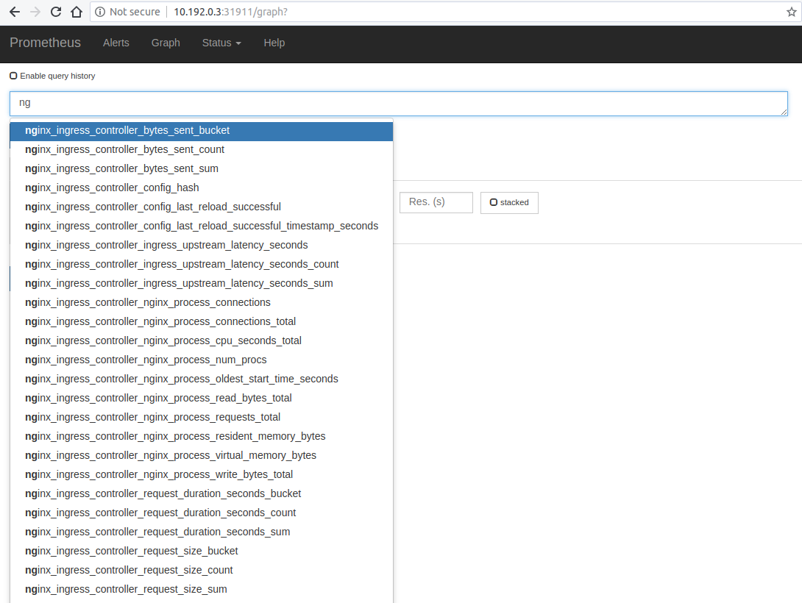

# Prometheus and Grafana installation

本教程将向您展示如何安装 [Prometheus](https://prometheus.io/) 和 [Grafana](https://grafana.com/) 通过nginx ingress controller收取指标.

!!! important
    这个例子对Prometheus和Grafana使用`emptyDir` volume。 这意味着，一旦吊舱终止，您将丢失所有数据。.

## Before You Begin

nginx Ingress控制器应该已经根据部署说明进行了部署 [here](../deploy/index.md).

请注意，本教程中使用的Kustomize 基于存储在 [deploy](https://github.com/kubernetes/ingress-nginx/tree/master/deploy) 目录，仓库为 [kubernetes/ingress-nginx](https://github.com/kubernetes/ingress-nginx).

## Deploy and configure Prometheus Server

必须配置Prometheus服务器，以便它可以发现服务的端点。 如果Prometheus服务器已经在集群中运行，并且以可以找到  ingress controller容器的方式进行了配置，则不需要额外的配置。

如果没有现有的Prometheus服务器正在运行，本教程的其余部分将指导您完成部署正确配置的Prometheus服务器所需的步骤。

运行以下命令可在Kubernetes中部署Prometheus:

```console
kubectl apply --kustomize github.com/kubernetes/ingress-nginx/deploy/prometheus/
serviceaccount/prometheus-server created
role.rbac.authorization.k8s.io/prometheus-server created
rolebinding.rbac.authorization.k8s.io/prometheus-server created
configmap/prometheus-configuration-bc6bcg7b65 created
service/prometheus-server created
deployment.apps/prometheus-server created
```

### Prometheus Dashboard

在网络浏览器中打开Prometheus仪表板:

```console
kubectl get svc -n ingress-nginx
NAME                   TYPE        CLUSTER-IP      EXTERNAL-IP   PORT(S)                                      AGE
default-http-backend   ClusterIP   10.103.59.201   <none>        80/TCP                                       3d
ingress-nginx NodePort    10.97.44.72     <none>        80:30100/TCP,443:30154/TCP,10254:32049/TCP   5h
prometheus-server      NodePort    10.98.233.86    <none>        9090:32630/TCP                               1m
```

获取正在运行的集群中节点的IP地址:

```console
kubectl get nodes -o wide
```

在某些情况下，该节点只有内部IP地址，我们需要执行:

```console
kubectl get nodes --selector=kubernetes.io/role!=master -o jsonpath={.items[*].status.addresses[?\(@.type==\"InternalIP\"\)].address}
10.192.0.2 10.192.0.3 10.192.0.4
```

打开浏览器并访问以下URL: _http://{node IP address}:{prometheus-svc-nodeport}_ 加载 Prometheus Dashboard.

根据上面的示例，此网址为 http://10.192.0.3:32630



### Grafana

```console
kubectl apply --kustomize github.com/kubernetes/ingress-nginx/deploy/grafana/
```

```console
kubectl get svc -n ingress-nginx
NAME                   TYPE        CLUSTER-IP      EXTERNAL-IP   PORT(S)                                      AGE
default-http-backend   ClusterIP   10.103.59.201   <none>        80/TCP                                       3d
ingress-nginx NodePort    10.97.44.72     <none>        80:30100/TCP,443:30154/TCP,10254:32049/TCP   5h
prometheus-server      NodePort    10.98.233.86    <none>        9090:32630/TCP                               10m
grafana                NodePort    10.98.233.87    <none>        3000:31086/TCP                               10m
```

打开浏览器并访问以下URL: _http://{node IP address}:{grafana-svc-nodeport}_ 加载Grafana Dashboard.
根据上面的示例，此网址为 http://10.192.0.3:31086

用户名密码为 `admin`

登录后，您可以从以下位置导入Grafana仪表板 _https://github.com/kubernetes/ingress-nginx/tree/master/deploy/grafana/dashboards_


